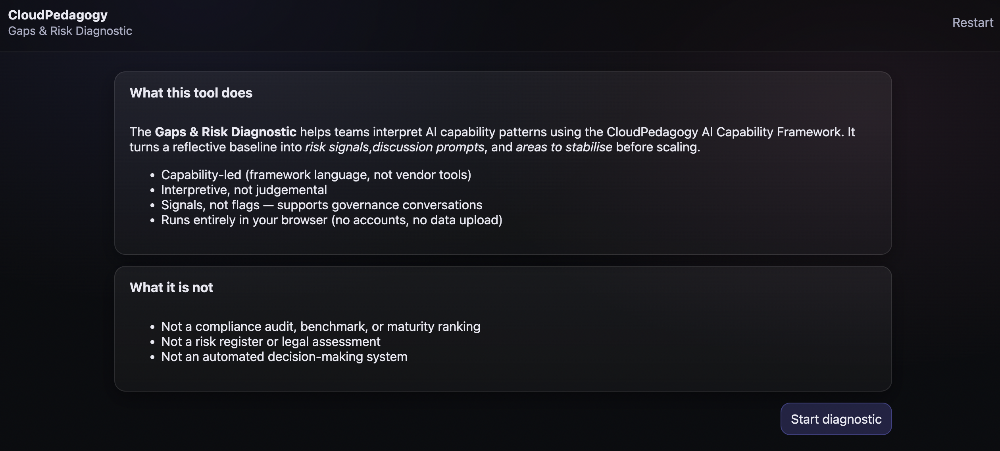

# AI Capability Gaps & Risk Diagnostic

A lightweight, browser-based diagnostic tool for interpreting AI capability patterns using the CloudPedagogy AI Capability Framework.
It helps teams surface gaps, imbalances, and risk signals to support reflective discussion, governance conversations, and responsible scaling of AI use in education, research, and public-service contexts.

## 🔗 Role in the CloudPedagogy Ecosystem

**Phase:** Phase 3 — Capability System

**Role:**
Diagnoses capability imbalances, structural deficits (gaps), and high-priority risks based on reflective capability signals.

**Upstream Inputs:**
Aggregate score signals and snapshots from the **Capability Assessment Tool** and **Capability Dashboard**.

**Downstream Outputs:**
Provides diagnostic JSON exports used to parameterize realistic risk scenarios in the **Scenario Stress Test**.

**Does NOT:**
- Collect primary data from individuals.
- Perform longitudinal benchmark tracking (this is for the Dashboard).


This tool is part of the **CloudPedagogy AI Capability Tools** suite.

---

## 🌐 Live Hosted Version

👉 http://cloudpedagogy-ai-capability-gaps-risk.s3-website-us-east-1.amazonaws.com/

---

## 🖼️ Screenshot



---

## 🛠️ Getting Started

### Clone the repository

```bash
git clone [repository-url]
cd [repository-folder]
```

### Install dependencies

```bash
npm install
```

### Run locally

```bash
npm run dev
```

Once running, your terminal will display a local URL (often http://localhost:5173). Open this in your browser to use the application.

### Build for production

```bash
npm run build
```

The production build will be generated in the `dist/` directory and can be deployed to any static hosting service.

---

## 🔐 Privacy & Security

- **Fully local**: All data remains in the user's browser  
- **No backend**: No external API calls or database storage  
- **Privacy-preserving**: No tracking or data exfiltration  
- Suitable for use in sensitive organisational and governance contexts  

---

## 🔍 Diagnostic & Prioritisation Features

This tool has been strengthened to serve as the primary diagnostic layer for capability-driven risk:

### 1. Explicit Gap Identification
The tool now explicitly ranks capability domains by the intensity of their deficit. Domains are categorized from **Low** to **Critical** based on their "Capability Floor," allowing teams to see exactly where structural fragility is highest.

### 2. Top 3 Priority Risks
Instead of a flat list of signals, the tool now identifies the **Top 3 Risks** based on contribution weights and organisational flags (e.g., sensitive data, public-facing outputs). This provides a clear starting point for committee discussions.

### 3. Transparent Signal Weighting
Every risk signal now displays its **Contribution Weight**. These weights are dynamic — for example, a "Capability Imbalance" signal becomes more critical if the organisation has also indicated heavy "Vendor Reliance" or "High-Stakes Use."

### 4. Stress Test Integration
The new **Download for Stress Test** feature generates a descriptive JSON snapshot containing:
- Domain maturity scores
- Ranked capability gaps
- Weighted priority risks
- Contextual organisational flags

---

## What this application is

The **AI Capability Gaps & Risk Diagnostic** helps individuals, teams, and organisations:

- interpret AI capability strengths and weaknesses across six domains
- surface gaps, imbalances, and fragilities that may not be obvious from averages alone
- support governance, QA, and leadership discussions
- identify stabilising steps before scaling AI use
- translate reflective inputs into structured discussion prompts

The tool is **capability-led**, **interpretive**, and **non-judgemental**.  
It is designed to support professional judgement — not replace it.

---

## What this application is not

This tool is **not**:

- a compliance audit or checklist
- a maturity model, benchmark, or ranking system
- a risk register or legal assessment
- an automated decision-making or recommendation system
- a substitute for institutional governance processes

All outputs are **signals and prompts**, not decisions.

---

## The AI Capability domains

The diagnostic works across six interdependent domains of AI capability:

1. **Awareness & Orientation**  
   Shared understanding, boundaries, risks, and realistic expectations of AI in context

2. **Human–AI Co-Agency**  
   Role clarity, partnership practices, prompting as collaboration, and human judgement in the loop

3. **Applied Practice & Innovation**  
   Practical use of AI in workflows, experimentation, iteration, and improvement of practice

4. **Ethics, Equity & Impact**  
   Fairness, inclusion, harm reduction, transparency, and attention to downstream impacts

5. **Decision-Making & Governance**  
   Accountability, approvals, oversight, policy alignment, and decision hygiene

6. **Reflection, Learning & Renewal**  
   Review cycles, learning from experience, capability renewal, and institutional memory

These domains act as **lenses**, not checkboxes.

---

## How the tool works (user overview)

1. Enter basic **context information** (team or organisation name, optional notes)
2. Provide **reflective domain scores (0–4)** for each capability domain  
   - If completing as a team, scores should be agreed through discussion
3. Optionally select **context signals** (e.g. high-stakes use, public-facing outputs, sensitive data)
4. Optionally provide **coverage estimates (0–100%)** to indicate structural emphasis
5. Generate a diagnostic that produces:
   - strength signals
   - gap signals
   - stabilisers already present
   - multi-domain risk and imbalance patterns
   - structured discussion prompts

The diagnostic is designed to be used **collaboratively**, not mechanically.

---

## Outputs

The tool generates a structured results view including:

- overall capability band and average score
- domain-level profile
- strength and gap signals
- interpreted risk and imbalance signals
- “why this matters” explanations
- committee- and workshop-ready discussion prompts

### Implementation Roadmap
- `[x]` Engine & Calculation Updates
    - `[x]` Update `src/engine/analysis.ts` types and dynamic weighting logic
    - `[x]` Implement ranking for capability gaps and top 3 priorities
- `[x]` Structured Export
    - `[x]` Create `src/engine/export.ts` for Stress Test JSON compatible output
- `[x]` UI: prioritisation & Transparency
    - `[x]` Update `src/views/ResultsView.tsx` with Priorities card and weight badges
    - `[x]` Add Ranked Gaps table/list
    - `[x]` Add JSON export button
- `[x]` Finalisation
    - `[x]` Update `README.md` with diagnostic layer documentation

### Export / reuse

- **Copy summary for discussion**  
  Copy/paste outputs into:
  - committee papers
  - QA notes
  - programme documentation
  - workshop or design sprint materials

- **Print / Save as PDF**  
  Uses the browser’s print function for archiving or sharing

---

## Typical use cases

- Programme and curriculum review
- QA, validation, and periodic review discussions
- AI governance and policy conversations
- Leadership and steering group sense-making
- Design workshops and reflective audits
- Identifying fragility before scaling AI use

The tool is especially effective when used with **cross-functional teams** (educators, professional staff, leaders).

---

## Data handling and privacy

- The application runs **entirely client-side**
- No accounts, analytics, or tracking
- No data is uploaded or transmitted
- All inputs exist only in the user’s browser session
- Suitable for static hosting (e.g. AWS S3)

---

## Disclaimer

This repository contains exploratory, framework-aligned tools developed for reflection, learning, and discussion.

These tools are provided **as-is** and are not production systems, audits, or compliance instruments. Outputs are indicative only and should be interpreted in context using professional judgement.

All applications are designed to run locally in the browser. No user data is collected, stored, or transmitted.

All example data and structures are synthetic and do not represent any real institution, programme, or curriculum.


---

Responsibility for interpretation and any subsequent use remains with the **user or adopting institution**.

---

## Licensing & Scope

This repository contains open-source software released under the MIT License.

CloudPedagogy frameworks, capability models, taxonomies, and training materials
are separate intellectual works and are licensed independently (typically under
Creative Commons Attribution–NonCommercial–ShareAlike 4.0).

This software is designed to support capability-aligned workflows but does not
embed or enforce any specific CloudPedagogy framework.


---

## About CloudPedagogy

CloudPedagogy develops open, governance-credible resources for building confident, responsible AI capability across education, research, and public service.

- Framework: https://github.com/cloudpedagogy/cloudpedagogy-ai-capability-framework

---

## Capability and Governance
This tool supports both AI capability development and lightweight governance.
- **Capability** is developed through structured interaction with real workflows
- **Governance** is supported through optional fields that make assumptions, risks, and decisions visible
All governance inputs are optional and designed to support — not constrain — professional judgement.

